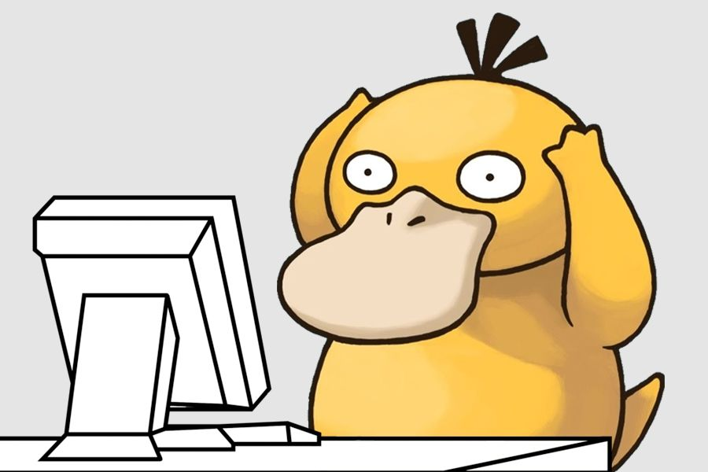

  

<h1 align="center">Hi 👋, I'm Tarek Hossain</h1>
<h3 align="center">Computer Science Student @ BRAC University</h3>

---

## 👨‍💻 About Me

- 🎓 4th Year Computer Science Student at **BRAC University**
- 💻 Interested in **Full-Stack Development** and **Artificial Intelligence**
- 🌱 Currently learning **Data Structures & Algorithms**, **MERN Stack**, and **Machine Learning**
- 🏸 Badminton enthusiast
- 🎵 Music lover
- 🌍 My goal is to build technology that creates a positive impact.

---

## 🛠️ Tech Stack

  

---

## 📌 Current Focus

- 📚 Solving problems on LeetCode
- 🚀 Building MERN Stack projects
- 🤖 Exploring AI & Machine Learning
- 📖 Learning better software engineering practices

---

## 🤝 Connect With Me

- 📧 **Email:** tarek.hossain90267@gmail.com
- 💼 **LinkedIn:** https://linkedin.com/in/tarek-hossain-26ab34262

---

> *"Code. Learn. Build. Improve."* 🚀
